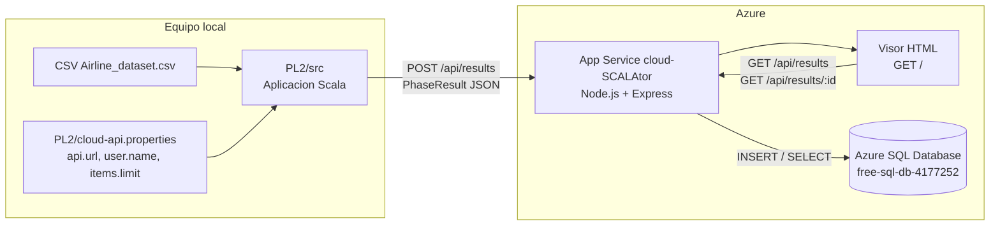
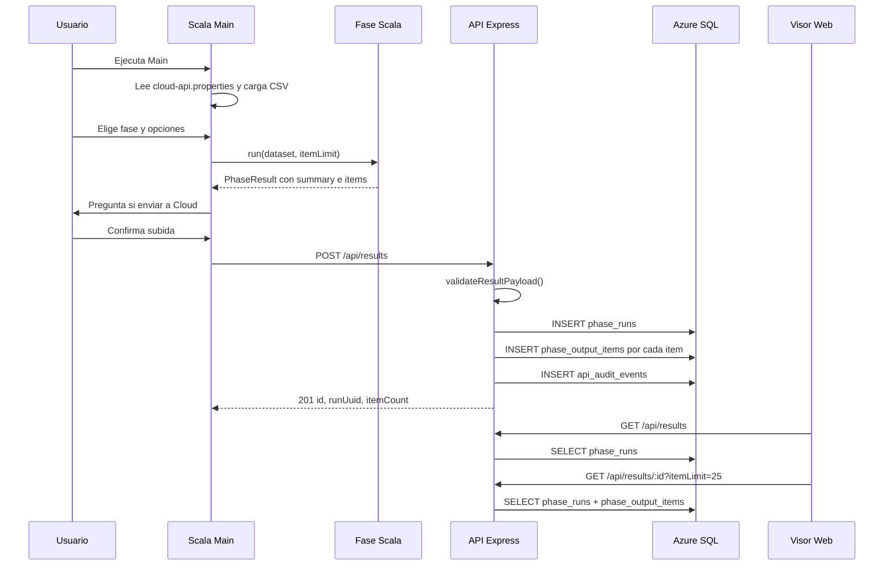
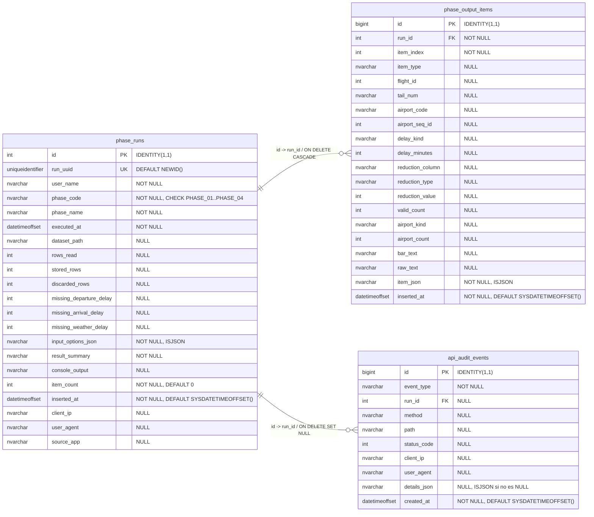
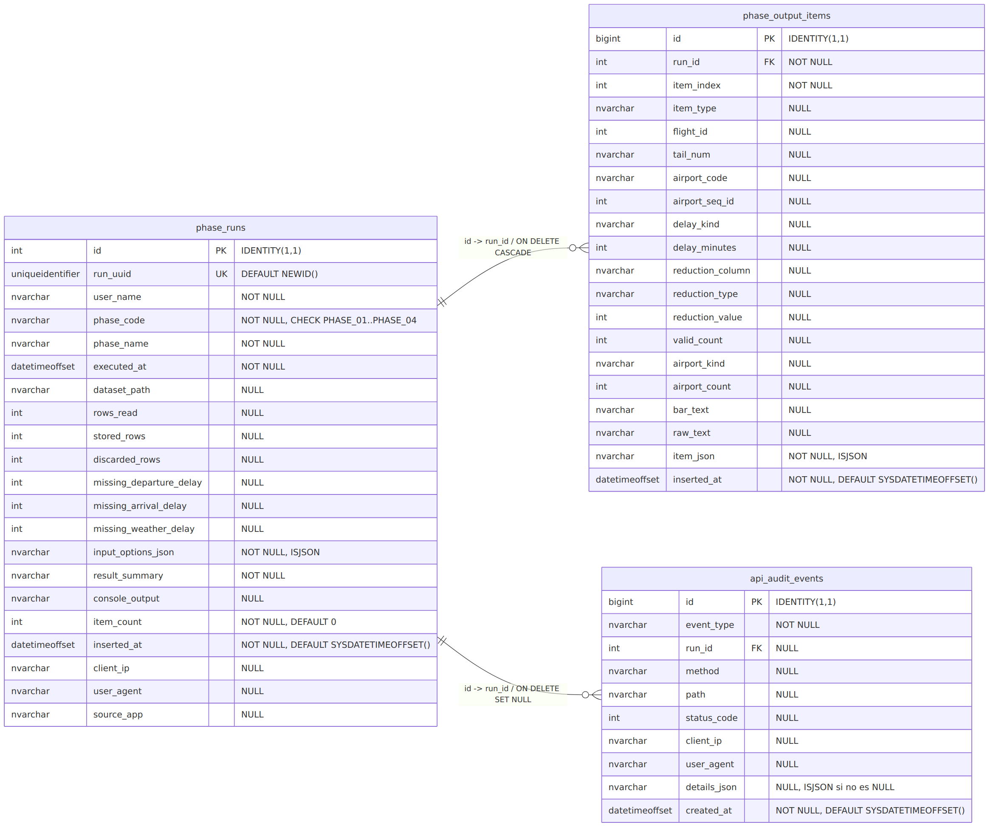
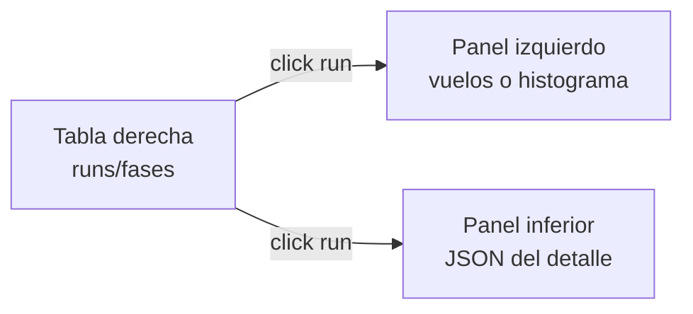

# cloud_SCALAtor

`cloud_SCALAtor` es la adaptacion Scala de la PL2 para el dataset "US Airline
Dataset" y, ademas, una integracion Cloud para guardar los resultados en Azure.
La aplicacion local ejecuta las fases de Scala, construye un resultado JSON por
fase y permite subirlo a una API Node.js/Express. Esa API valida el JSON, lo
guarda en Azure SQL y sirve un visor web para consultar ejecuciones e items.

Este README explica el funcionamiento tecnico del proyecto. La configuracion de
Azure, variables de App Service, comandos y pasos de despliegue se documentan en
`README_STATUS.md`.

## Estado Actual

La parte funcional principal esta dividida en dos bloques:

- `PL2/src`: aplicacion de consola Scala, lectura del CSV, fases 01 a 04,
  construccion de `PhaseResult`, serializacion JSON y subida opcional al Cloud.
- `cloud-api`: API Express, visor HTML, validacion del payload y persistencia en
  Azure SQL.

El flujo Cloud ya esta implementado en codigo:

- Scala lee `PL2/cloud-api.properties` si existe.
- Al arrancar se confirma la URL de la API, el usuario y el limite de items.
- Cada fase imprime su salida por consola y genera tambien items estructurados.
- Al terminar una fase, Scala pregunta si se quiere enviar ese resultado.
- Si se acepta, Scala manda un unico `POST /api/results` con la ejecucion
  completa y el array `items`.
- La API guarda una fila de run en `phase_runs` y una fila por item en
  `phase_output_items`.
- El visor web muestra ejecuciones, detalle JSON y una tabla lateral de items
  para Fase 01/Fase 02.

La subida no es completamente automatica despues de cada fase: el codigo pregunta
al usuario con `Enviar este resultado a la API? [S/n]:`. Esto permite elegir si
se sube o no una ejecucion concreta.

## Arquitectura



Secuencia de una ejecucion normal:



## Estructura Del Repositorio

```text
.
├── README.md
├── README_STATUS.md                  # guia local de configuracion Cloud, ignorada por git
├── .github/workflows/
│   └── main_cloud-scalator.yml       # build/deploy de cloud-api a App Service
├── PL2/
│   ├── cloud-api.example.properties  # ejemplo de configuracion Scala -> API
│   ├── data/
│   │   └── Airline_dataset.csv
│   └── src/
│       ├── Main.scala
│       ├── Models.scala
│       ├── CsvReader.scala
│       ├── AppUtils.scala
│       ├── CloudConfigReader.scala
│       ├── CloudApiClient.scala
│       ├── Phase01.scala
│       ├── Phase02.scala
│       ├── Phase03.scala
│       └── Phase04.scala
└── cloud-api/
    ├── package.json
    ├── src/
    │   ├── server.js
    │   ├── db.js
    │   └── validation.js
    ├── db/
    │   ├── schema.sql
    │   └── sample-data.sql
    └── public/
        └── index.html
```

Responsabilidades principales:

| Fichero | Responsabilidad |
| --- | --- |
| `PL2/src/Main.scala` | Punto de entrada, menu, carga de CSV, confirmacion de subida Cloud. |
| `PL2/src/Models.scala` | Modelos inmutables: `Flight`, `Dataset`, `PhaseResult`, `CloudResultItem`, `CloudConfig`. |
| `PL2/src/CsvReader.scala` | Lectura del CSV y normalizacion de columnas necesarias. |
| `PL2/src/Phase01.scala` | Retrasos/adelantos en salida (`DEP_DELAY`). |
| `PL2/src/Phase02.scala` | Retrasos/adelantos en llegada (`ARR_DELAY`) con matricula (`TAIL_NUM`). |
| `PL2/src/Phase03.scala` | Reduccion simple maximo/minimo sobre columna de retraso. |
| `PL2/src/Phase04.scala` | Histograma textual de aeropuertos de origen o destino. |
| `PL2/src/CloudConfigReader.scala` | Carga de URL, usuario y limite de items desde propiedades locales. |
| `PL2/src/CloudApiClient.scala` | Construccion del JSON y envio HTTP a la API. |
| `cloud-api/src/server.js` | Endpoints Express, transacciones SQL y visor HTML. |
| `cloud-api/src/validation.js` | Validacion y normalizacion del payload recibido. |
| `cloud-api/src/db.js` | Conexion `mssql` usando variables `DB_*`. |
| `cloud-api/db/schema.sql` | Tablas SQL de runs, items y auditoria. |
| `cloud-api/public/index.html` | Interfaz web para consultar resultados. |

## Dataset Local

Scala espera un CSV con las columnas usadas por la PL. El lector usa posiciones
fijas:

| Indice | Campo usado |
| ---: | --- |
| 0 | Identificador de fila usado como `id` |
| 3 | `TAIL_NUM` |
| 5 | `ORIGIN_SEQ_ID` |
| 6 | `ORIGIN_AIRPORT` |
| 7 | `DEST_SEQ_ID` |
| 8 | `DEST_AIRPORT` |
| 10 | `DEP_DELAY` |
| 12 | `ARR_DELAY` |
| 13 | `WEATHER_DELAY` |

Cada fila necesita al menos 14 columnas. Las filas incompletas se descartan. Los
campos numericos vacios o invalidos se guardan como `None`; por eso no
participan en filtros, reducciones ni histogramas que dependan de ese dato.

## Funcionamiento De Scala

Al ejecutar `Main`, el programa hace este recorrido:

1. Muestra cabecera y version.
2. Llama a `CloudConfigReader.loadAndConfirm()`.
3. Carga `PL2/cloud-api.properties` si existe, o usa valores por defecto.
4. Pregunta si se mantienen o cambian la URL, el usuario y el limite de items.
5. Pide la ruta del CSV y carga el dataset.
6. Muestra el menu principal.
7. Ejecuta la fase elegida.
8. La fase imprime resultados y devuelve un `PhaseResult`.
9. `Main.offerCloudUpload()` pregunta si se sube el resultado.
10. Si se acepta, `CloudApiClient.postResult()` hace el `POST`.

Menu principal:

```text
Menu principal
1. Fase 01 - Retraso en salida
2. Fase 02 - Retraso en llegada
3. Fase 03 - Reduccion de retraso
4. Fase 04 - Histograma de aeropuertos
R. Recargar CSV
I. Ver estado de la aplicacion
X. Salir
CSV actual: <ruta>
```

La configuracion local real no se sube a git. Se crea copiando el ejemplo:

```properties
api.url=http://localhost:3000/api/results
user.name=alumno.demo
items.limit=5000
```

`api.url` puede ser la URL completa de `POST /api/results` o la URL base del App
Service. Si se escribe solo la base, `CloudApiClient` completa `/api/results`.

`items.limit` controla cuantos items detallados manda Scala en esa ejecucion. El
resultado conserva tambien el total real:

- `totalItemCount`: cuantos items genero la fase.
- `sentItemCount`: cuantos items se incluyen en el JSON.
- `itemsTruncated`: `true` si hubo mas items que el limite configurado.

## Modelos Scala Que Viajan A Cloud

Los modelos clave estan en `Models.scala`:

```scala
final case class CloudResultItem(
    itemType: String,
    flightId: Option[Int] = None,
    tailNum: Option[String] = None,
    airportCode: Option[String] = None,
    airportSeqId: Option[Int] = None,
    delayKind: Option[String] = None,
    delayMinutes: Option[Int] = None,
    reductionColumn: Option[String] = None,
    reductionType: Option[String] = None,
    reductionValue: Option[Int] = None,
    validCount: Option[Int] = None,
    airportKind: Option[String] = None,
    airportCount: Option[Int] = None,
    barText: Option[String] = None,
    rawText: Option[String] = None
)

final case class PhaseResult(
    phaseCode: String,
    phaseName: String,
    inputOptionsJson: String,
    resultSummary: String,
    items: List[CloudResultItem],
    totalItemCount: Int,
    sentItemCount: Int,
    itemsTruncated: Boolean
)
```

`CloudResultItem` es polimorfico: todas las fases usan la misma estructura, pero
cada tipo de item rellena solo sus campos. Los campos que no aplican se mandan
como `null` y en SQL quedan como `NULL`.

## Fases Y Datos Generados

| Fase | Entrada de usuario | Salida de consola | `itemType` | Campos principales |
| --- | --- | --- | --- | --- |
| Fase 01 | Umbral sobre `DEP_DELAY` | Vuelos con retraso/adelanto en salida | `delay_match` | `flightId`, `delayKind`, `delayMinutes`, `rawText` |
| Fase 02 | Umbral sobre `ARR_DELAY` | Vuelos con retraso/adelanto en llegada y matricula | `delay_match` | `flightId`, `tailNum`, `delayKind`, `delayMinutes`, `rawText` |
| Fase 03 | Columna y maximo/minimo | Un valor reducido | `reduction` | `reductionColumn`, `reductionType`, `reductionValue`, `validCount`, `rawText` |
| Fase 04 | Origen/destino y umbral minimo | Histograma textual de aeropuertos | `airport_histogram` | `airportKind`, `airportCode`, `airportSeqId`, `airportCount`, `barText`, `rawText` |

Scala no manda cada item con una peticion independiente. Manda una ejecucion
entera de fase en una sola peticion:

```text
1 POST = 1 phase run + N items
```

Esto permite que la API guarde la cabecera del run y sus items dentro de una
transaccion. Si falla una insercion, se revierte todo el run.

## Contrato JSON De `POST /api/results`

La raiz del JSON tiene esta forma:

```json
{
  "userName": "alumno.demo",
  "executedAt": "2026-05-14T12:00:00+02:00",
  "sourceApp": "cloud_SCALAtor Scala",
  "phase": {
    "code": "PHASE_01",
    "name": "Fase 01 - Retraso en salida"
  },
  "inputOptions": {
    "phaseOptions": {
      "threshold": 60,
      "delayColumn": "DEP_DELAY"
    },
    "totalItemCount": 1200,
    "sentItemCount": 500,
    "itemsTruncated": true
  },
  "summary": "Coincidencias encontradas: 1200",
  "dataset": {
    "path": "PL2/data/Airline_dataset.csv",
    "rowsRead": 1204825,
    "storedRows": 1204825,
    "discardedRows": 0,
    "missingDepartureDelay": 0,
    "missingArrivalDelay": 0,
    "missingWeatherDelay": 0
  },
  "items": []
}
```

Objetos hijos:

| Objeto | Uso |
| --- | --- |
| `phase` | Identifica la fase. `phase.code` debe ser `PHASE_01`, `PHASE_02`, `PHASE_03` o `PHASE_04`. |
| `inputOptions` | Guarda las opciones elegidas y los contadores de truncado. Se almacena como JSON en `phase_runs.input_options_json`. |
| `dataset` | Guarda ruta y resumen de carga del CSV. |
| `items` | Array obligatorio. Puede estar vacio, pero debe ser un array. |

`items` se eligio como array porque una fase puede producir muchos resultados:
muchos vuelos coincidentes, muchos aeropuertos de histograma o un item de
reduccion. La API necesita recibirlos ordenados para asignar `item_index` y
guardarlos en `phase_output_items`.

## JSON De Ejemplo Por Fase

### Fase 01

Salida de consola aproximada:

```text
- Id dataset #103309: Retraso de 1855 minutos
Coincidencias encontradas: 1
```

Item enviado dentro de `items`:

```json
{
  "itemType": "delay_match",
  "flightId": 103309,
  "tailNum": null,
  "airportCode": null,
  "airportSeqId": null,
  "delayKind": "Retraso",
  "delayMinutes": 1855,
  "reductionColumn": null,
  "reductionType": null,
  "reductionValue": null,
  "validCount": null,
  "airportKind": null,
  "airportCount": null,
  "barText": null,
  "rawText": "- Id dataset #103309: Retraso de 1855 minutos"
}
```

Payload completo reducido:

```json
{
  "userName": "alumno.demo",
  "executedAt": "2026-05-14T12:00:00+02:00",
  "sourceApp": "cloud_SCALAtor Scala",
  "phase": { "code": "PHASE_01", "name": "Fase 01 - Retraso en salida" },
  "inputOptions": {
    "phaseOptions": { "threshold": 1440, "delayColumn": "DEP_DELAY" },
    "totalItemCount": 1,
    "sentItemCount": 1,
    "itemsTruncated": false
  },
  "summary": "Coincidencias encontradas: 1",
  "dataset": {
    "path": "PL2/data/Airline_dataset.csv",
    "rowsRead": 1204825,
    "storedRows": 1204825,
    "discardedRows": 0,
    "missingDepartureDelay": 0,
    "missingArrivalDelay": 0,
    "missingWeatherDelay": 0
  },
  "items": [
    {
      "itemType": "delay_match",
      "flightId": 103309,
      "delayKind": "Retraso",
      "delayMinutes": 1855,
      "rawText": "- Id dataset #103309: Retraso de 1855 minutos"
    }
  ]
}
```

### Fase 02

Salida de consola aproximada:

```text
- Id dataset #29182  Matricula: N782SA  Retraso (llegada): 248 min
Se han encontrado 1 aviones
```

Item:

```json
{
  "itemType": "delay_match",
  "flightId": 29182,
  "tailNum": "N782SA",
  "delayKind": "Retraso (llegada)",
  "delayMinutes": 248,
  "rawText": "- Id dataset #29182  Matricula: N782SA  Retraso (llegada): 248 min"
}
```

Payload reducido:

```json
{
  "userName": "alumno.demo",
  "executedAt": "2026-05-14T12:10:00+02:00",
  "sourceApp": "cloud_SCALAtor Scala",
  "phase": { "code": "PHASE_02", "name": "Fase 02 - Retraso en llegada" },
  "inputOptions": {
    "phaseOptions": { "threshold": 180, "delayColumn": "ARR_DELAY", "includeTailNum": true },
    "totalItemCount": 1,
    "sentItemCount": 1,
    "itemsTruncated": false
  },
  "summary": "Coincidencias encontradas: 1",
  "dataset": {
    "path": "PL2/data/Airline_dataset.csv",
    "rowsRead": 1204825,
    "storedRows": 1204825,
    "discardedRows": 0,
    "missingDepartureDelay": 0,
    "missingArrivalDelay": 0,
    "missingWeatherDelay": 0
  },
  "items": [
    {
      "itemType": "delay_match",
      "flightId": 29182,
      "tailNum": "N782SA",
      "delayKind": "Retraso (llegada)",
      "delayMinutes": 248,
      "rawText": "- Id dataset #29182  Matricula: N782SA  Retraso (llegada): 248 min"
    }
  ]
}
```

### Fase 03

Salida de consola aproximada:

```text
[Simple] Max() DEP_DELAY = 1855 minutos
```

Item:

```json
{
  "itemType": "reduction",
  "reductionColumn": "DEP_DELAY",
  "reductionType": "Maximo",
  "reductionValue": 1855,
  "validCount": 1204825,
  "rawText": "[Simple] Max() DEP_DELAY = 1855 minutos; validos=1204825"
}
```

Payload reducido:

```json
{
  "userName": "alumno.demo",
  "executedAt": "2026-05-14T12:20:00+02:00",
  "sourceApp": "cloud_SCALAtor Scala",
  "phase": { "code": "PHASE_03", "name": "Fase 03 - Reduccion de retraso" },
  "inputOptions": {
    "phaseOptions": { "column": "DEP_DELAY", "reduction": "Maximo" },
    "totalItemCount": 1,
    "sentItemCount": 1,
    "itemsTruncated": false
  },
  "summary": "[Simple] Max() DEP_DELAY = 1855 minutos; validos=1204825",
  "dataset": {
    "path": "PL2/data/Airline_dataset.csv",
    "rowsRead": 1204825,
    "storedRows": 1204825,
    "discardedRows": 0,
    "missingDepartureDelay": 0,
    "missingArrivalDelay": 0,
    "missingWeatherDelay": 0
  },
  "items": [
    {
      "itemType": "reduction",
      "reductionColumn": "DEP_DELAY",
      "reductionType": "Maximo",
      "reductionValue": 1855,
      "validCount": 1204825,
      "rawText": "[Simple] Max() DEP_DELAY = 1855 minutos; validos=1204825"
    }
  ]
}
```

### Fase 04

Salida de consola aproximada:

```text
ATL (1039707) | 34521 ########################################
```

Item:

```json
{
  "itemType": "airport_histogram",
  "airportKind": "origen",
  "airportCode": "ATL",
  "airportSeqId": 1039707,
  "airportCount": 34521,
  "barText": "########################################",
  "rawText": "ATL (1039707) | 34521 ########################################"
}
```

Payload reducido:

```json
{
  "userName": "alumno.demo",
  "executedAt": "2026-05-14T12:30:00+02:00",
  "sourceApp": "cloud_SCALAtor Scala",
  "phase": { "code": "PHASE_04", "name": "Fase 04 - Histograma de aeropuertos" },
  "inputOptions": {
    "phaseOptions": { "airportType": "origen", "threshold": 1000 },
    "totalItemCount": 80,
    "sentItemCount": 80,
    "itemsTruncated": false
  },
  "summary": "Aeropuertos mostrados=80; total=300; filas validas=1204825",
  "dataset": {
    "path": "PL2/data/Airline_dataset.csv",
    "rowsRead": 1204825,
    "storedRows": 1204825,
    "discardedRows": 0,
    "missingDepartureDelay": 0,
    "missingArrivalDelay": 0,
    "missingWeatherDelay": 0
  },
  "items": [
    {
      "itemType": "airport_histogram",
      "airportKind": "origen",
      "airportCode": "ATL",
      "airportSeqId": 1039707,
      "airportCount": 34521,
      "barText": "########################################",
      "rawText": "ATL (1039707) | 34521 ########################################"
    }
  ]
}
```

Para ver un histograma completo en la nube, Scala debe enviar todos los
aeropuertos que quiera conservar. Si `items.limit` es menor que el numero de
aeropuertos mostrados, en SQL solo estaran los primeros `sentItemCount`; el total
real quedara indicado en `inputOptions.totalItemCount` y en el resumen.

## API Express

La API se arranca desde `cloud-api`:

```bash
cd cloud-api
npm install
npm start
```

`package.json` define:

```json
{
  "main": "src/server.js",
  "scripts": {
    "start": "node src/server.js",
    "check": "node --check src/server.js && node --check src/db.js && node --check src/validation.js"
  }
}
```

Endpoints disponibles:

| Metodo | Ruta | Funcion |
| --- | --- | --- |
| `GET` | `/` | Devuelve `public/index.html`. |
| `GET` | `/api/health` | Comprueba que la API esta viva y si detecta variables de BD. |
| `POST` | `/api/results` | Recibe una ejecucion de fase y la guarda. |
| `GET` | `/api/results` | Lista ejecuciones. Acepta `limit`, `user`, `phase`. |
| `GET` | `/api/results/:id` | Devuelve una ejecucion y sus items. Acepta `itemLimit`. |
| `GET` | `/api/audit` | Lista eventos de auditoria. |

### Validacion

`validation.js` normaliza el payload antes de que `server.js` lo guarde:

- `userName` es obligatorio y maximo 120 caracteres.
- `phase.code` es obligatorio y maximo 20 caracteres.
- `phase.name` es obligatorio y maximo 160 caracteres.
- `summary` es obligatorio y maximo 1000 caracteres.
- `executedAt` debe ser fecha valida; si no se manda, se usa la fecha actual del
  servidor.
- `items` debe ser un array.
- Se aceptan como maximo `1000000` items en una sola peticion.
- Los enteros no validos se convierten a `null` en columnas especificas.
- Cada item original se conserva tambien en `itemJson`.

### Insercion SQL

`POST /api/results` hace una transaccion:

1. Valida el payload.
2. Inserta una fila en `phase_runs`.
3. Recupera `id` y `run_uuid` generados por SQL.
4. Inserta cada item en `phase_output_items` con el mismo `run_id`.
5. Confirma la transaccion.
6. Inserta un evento `result_inserted` en `api_audit_events`.

Si algo falla durante la insercion, intenta hacer rollback y registra
`insert_error`.

Respuesta correcta:

```json
{
  "id": 42,
  "runUuid": "4ecb2f6f-f063-44c2-88c4-b12b9f04e032",
  "itemCount": 25
}
```

## Base De Datos

El esquema esta en `cloud-api/db/schema.sql`. Crea tres tablas:

- `phase_runs`: una fila por ejecucion de fase.
- `phase_output_items`: cero, una o muchas filas de detalle por ejecucion.
- `api_audit_events`: eventos tecnicos de la API.

Atencion: `schema.sql` empieza con `DROP TABLE`. Ejecutarlo de nuevo borra las
tablas y los datos actuales.

Diagrama relacional completo:



Imagen renderizada del diagrama:



Tambien esta disponible como [`PL2_diagrama_bd_logico.svg`](PL2_diagrama_bd_logico.svg)
y como fuente Mermaid en [`PL2_diagrama_bd_logico.mmd`](PL2_diagrama_bd_logico.mmd).

### `phase_runs`

Guarda la cabecera de una ejecucion:

| Columna | Uso |
| --- | --- |
| `id` | Identificador interno autoincremental. |
| `run_uuid` | Identificador publico unico generado con `NEWID()`. |
| `user_name` | Usuario configurado en Scala. |
| `phase_code`, `phase_name` | Fase ejecutada. |
| `executed_at` | Fecha/hora de ejecucion enviada por Scala. |
| `dataset_path` | Ruta local del CSV usado. |
| `rows_read`, `stored_rows`, `discarded_rows` | Resumen de carga del CSV. |
| `missing_*_delay` | Conteo de valores ausentes en columnas de retraso. |
| `input_options_json` | Opciones de la fase y contadores de truncado. |
| `result_summary` | Resumen textual de la fase. |
| `console_output` | Campo opcional para salida completa si se quisiera enviar. |
| `item_count` | Numero de items realmente recibidos en esa peticion. |
| `client_ip`, `user_agent`, `source_app` | Metadatos tecnicos de la peticion. |

Reglas principales:

- `phase_code` solo acepta `PHASE_01`, `PHASE_02`, `PHASE_03`, `PHASE_04`.
- `input_options_json` debe ser JSON valido (`ISJSON(...) = 1`).
- Hay indices por fecha, usuario y fase.

### `phase_output_items`

Guarda los detalles de cada run. Es una tabla polimorfica: una misma tabla
soporta items de tipos distintos.

| Tipo de item | Columnas que usa |
| --- | --- |
| `delay_match` Fase 01 | `flight_id`, `delay_kind`, `delay_minutes`, `raw_text` |
| `delay_match` Fase 02 | `flight_id`, `tail_num`, `delay_kind`, `delay_minutes`, `raw_text` |
| `reduction` Fase 03 | `reduction_column`, `reduction_type`, `reduction_value`, `valid_count`, `raw_text` |
| `airport_histogram` Fase 04 | `airport_kind`, `airport_code`, `airport_seq_id`, `airport_count`, `bar_text`, `raw_text` |

Las columnas que no aplican quedan `NULL`. El item completo se conserva en
`item_json`, por lo que un campo extra no se pierde aunque no tenga columna
dedicada.

Reglas principales:

- `run_id` apunta a `phase_runs.id`.
- `ON DELETE CASCADE`: si se borra un run, se borran sus items.
- `item_index` conserva el orden recibido.
- `item_json` debe ser JSON valido.
- El indice `(run_id, item_index)` acelera la carga de detalle de un run.

Ejemplo de almacenamiento para Fase 02:

| Columna | Valor |
| --- | --- |
| `run_id` | `42` |
| `item_index` | `0` |
| `item_type` | `delay_match` |
| `flight_id` | `29182` |
| `tail_num` | `N782SA` |
| `delay_kind` | `Retraso (llegada)` |
| `delay_minutes` | `248` |
| `raw_text` | `- Id dataset #29182  Matricula: N782SA  Retraso (llegada): 248 min` |
| `airport_code`, `reduction_column`, etc. | `NULL` |
| `item_json` | JSON original del item |

### `api_audit_events`

Guarda eventos de servicio:

- `validation_error`: payload incorrecto.
- `insert_error`: fallo durante la insercion.
- `result_inserted`: run guardado correctamente.

`run_id` puede ser `NULL`, porque algunos errores ocurren antes de crear el run.
Si se borra un run, los eventos quedan, pero `run_id` se pone a `NULL` por
`ON DELETE SET NULL`.

## Visor Web

`cloud-api/public/index.html` es una pagina HTML sin framework. La sirve la API
en `GET /`.

Funciones actuales:

- Filtrar por usuario.
- Filtrar por fase.
- Elegir cuantas ejecuciones cargar: 25, 50, 100, 250 o 500.
- Elegir cuantos items cargar del detalle: 25, 50, 100, 250 o 500.
- Mostrar tabla principal de runs.
- Al seleccionar una ejecucion, cargar `GET /api/results/:id?itemLimit=N`.
- Mostrar el JSON de items en el panel de detalle.
- Para Fase 01 y Fase 02, mostrar una tabla lateral de items con una fila por
  vuelo cargado.
- Para Fase 04, mostrar una tabla lateral de histograma con aeropuerto, ID,
  numero de vuelos y barra horizontal proporcional.

Distribucion de la pantalla para Fase 01, Fase 02 y Fase 04:



Para Fase 04, las barras se calculan en el navegador a partir de
`airport_count`. La barra mayor de los items cargados ocupa el 100% del ancho y
el resto se escala proporcionalmente. El selector `Items detalle` decide cuantos
aeropuertos se cargan y se representan.

Para Fase 03, el detalle se mantiene como JSON porque la fase produce un unico
item de reduccion.

## Limites Actuales

| Lado | Limite |
| --- | --- |
| Scala | `items.limit` decide cuantos items se envian por ejecucion. El ejemplo usa `5000`. |
| Scala | `CloudConfigReader` admite hasta `1000000` como limite local. |
| API escritura | `express.json({ limit: '1gb' })`. |
| API escritura | `MaxItemsPerRequest = 1000000`. |
| API lectura de runs | `GET /api/results?limit=N`, maximo `500`. |
| API lectura de detalle | `GET /api/results/:id?itemLimit=N`, por defecto `25`, maximo `500`. |
| Visor web | Selector de detalle: 25, 50, 100, 250, 500. |

El limite de `1000000` items es para pruebas. La implementacion actual inserta
los items uno a uno dentro de una transaccion. Con cientos de miles de filas
puede tardar mucho o fallar por memoria, timeout del cliente, timeout del App
Service o tiempo de transaccion en SQL. Para una version robusta haria falta
carga por lotes o insercion bulk.

## Ejecucion Local

### API Local

Desde la raiz:

```bash
cd cloud-api
npm install
```

Configurar variables de entorno. En Linux/macOS:

```bash
export DB_SERVER=cloud-scalator.database.windows.net
export DB_PORT=1433
export DB_NAME=free-sql-db-4177252
export DB_USER=<usuario_sql>
export DB_PASSWORD='<password_sql>'
export DB_ENCRYPT=true
export DB_TRUST_SERVER_CERTIFICATE=false
export SOURCE_APP='cloud_SCALAtor Scala'
npm start
```

En Windows PowerShell:

```powershell
$env:DB_SERVER="cloud-scalator.database.windows.net"
$env:DB_PORT="1433"
$env:DB_NAME="free-sql-db-4177252"
$env:DB_USER="<usuario_sql>"
$env:DB_PASSWORD="<password_sql>"
$env:DB_ENCRYPT="true"
$env:DB_TRUST_SERVER_CERTIFICATE="false"
$env:SOURCE_APP="cloud_SCALAtor Scala"
npm start
```

Comprobar:

```bash
curl http://localhost:3000/api/health
```

Debe devolver:

```json
{ "ok": true, "databaseConfigured": true }
```

Si `databaseConfigured` es `true` pero faltan tablas, `/api/health` seguira
respondiendo bien. El error aparecera al hacer `POST /api/results` o consultar
`GET /api/results`, porque SQL dira que no existen `phase_runs`,
`phase_output_items` o `api_audit_events`.

### Scala Local

Desde la raiz, con `scalac` y `scala` instalados:

```bash
mkdir -p PL2/out
scalac -d PL2/out PL2/src/*.scala
scala -cp PL2/out Main
```

O desde `PL2`:

```bash
mkdir -p out
scalac -d out src/*.scala
scala -cp out Main
```

Para conectar Scala con la API local:

```properties
api.url=http://localhost:3000/api/results
user.name=alumno.demo
items.limit=5000
```

Para conectar Scala con la API desplegada en Azure:

```properties
api.url=https://cloud-scalator.azurewebsites.net/api/results
user.name=alumno.demo
items.limit=5000
```

El dominio exacto se confirma en el portal de App Service, en `Overview` /
`Default domain`.

## Prueba Manual Del POST

Con la API arrancada:

```bash
curl -X POST http://localhost:3000/api/results \
  -H "Content-Type: application/json" \
  -d '{
    "userName": "alumno.demo",
    "executedAt": "2026-05-14T12:00:00+02:00",
    "sourceApp": "cloud_SCALAtor Scala",
    "phase": { "code": "PHASE_01", "name": "Fase 01 - Retraso en salida" },
    "inputOptions": {
      "phaseOptions": { "threshold": 60, "delayColumn": "DEP_DELAY" },
      "totalItemCount": 1,
      "sentItemCount": 1,
      "itemsTruncated": false
    },
    "summary": "Coincidencias encontradas: 1",
    "dataset": {
      "path": "PL2/data/Airline_dataset.csv",
      "rowsRead": 1204825,
      "storedRows": 1204825,
      "discardedRows": 0,
      "missingDepartureDelay": 0,
      "missingArrivalDelay": 0,
      "missingWeatherDelay": 0
    },
    "items": [
      {
        "itemType": "delay_match",
        "flightId": 103309,
        "delayKind": "Retraso",
        "delayMinutes": 1855,
        "rawText": "- Id dataset #103309: Retraso de 1855 minutos"
      }
    ]
  }'
```

Despues:

```bash
curl "http://localhost:3000/api/results?limit=25"
curl "http://localhost:3000/api/results/1?itemLimit=25"
```

## Despliegue

El despliegue automatico esta en `.github/workflows/main_cloud-scalator.yml`.
El workflow:

- se lanza al hacer push a `main` solo si cambia `cloud-api/**` o el propio
  workflow;
- usa Node `24.x`;
- ejecuta `npm ci`, `npm run check`, `npm run build --if-present` y
  `npm run test --if-present` dentro de `cloud-api`;
- sube `cloud-api` como artefacto;
- despliega ese artefacto como raiz de la App Service `cloud-SCALAtor`.

Por eso no hace falta mantener `package.json` ni `index.js` en la raiz del repo:
la aplicacion real esta dentro de `cloud-api`.

## Seguridad Y Pendientes Tecnicos

- `POST /api/results` no tiene token ni autenticacion propia. Cualquiera con la
  URL podria insertar datos si la API esta publica.
- `DB_PASSWORD` nunca debe subirse al repositorio. En Azure va en App Service /
  Configuration / Application settings.
- `schema.sql` borra tablas antes de crearlas. No debe ejecutarse sobre una base
  con datos que se quieran conservar.
- La insercion masiva actual no usa bulk insert. Sirve para pruebas, pero no es
  la forma mas eficiente de cargar cientos de miles de items.
- El visor limita el detalle a 500 items por consulta para no bloquear el
  navegador.
