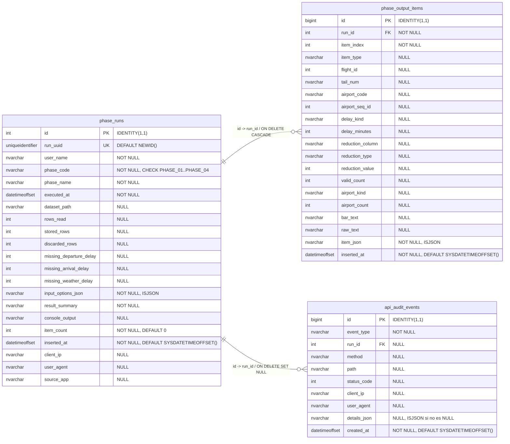

# cloud_SCALAtor API

API y visor web para almacenar en Azure SQL las salidas de la PL2 ejecutadas
desde Scala. La documentacion completa del flujo esta en `../README.md`; la
configuracion de Azure esta en `../README_STATUS.md`.

## Estructura

- `src/server.js`: API Express, endpoints y transacciones SQL.
- `src/db.js`: conexion a Azure SQL con `mssql` y variables `DB_*`.
- `src/validation.js`: validacion y normalizacion del JSON recibido.
- `db/schema.sql`: tablas para runs, items y auditoria.
- `public/index.html`: visor HTML servido por `GET /`.

## Preparacion Local

```bash
cd cloud-api
npm install
```

Configura variables de entorno antes de arrancar:

```bash
export DB_SERVER=cloud-scalator.database.windows.net
export DB_PORT=1433
export DB_NAME=free-sql-db-4177252
export DB_USER=<usuario_sql>
export DB_PASSWORD='<password_sql>'
export DB_ENCRYPT=true
export DB_TRUST_SERVER_CERTIFICATE=false
export SOURCE_APP='cloud_SCALAtor Scala'
npm start
```

Antes de insertar resultados hay que crear las tablas de `db/schema.sql` en la
base de datos. Ese script borra tablas existentes antes de crearlas.

Desde Scala, la URL local en `PL2/cloud-api.properties` es:

```properties
api.url=http://localhost:3000/api/results
```

En Azure se sustituye por la URL publica del App Service.

## Modelo De Base De Datos

La API guarda las ejecuciones en `phase_runs`, sus detalles en
`phase_output_items` y los eventos tecnicos en `api_audit_events`. El esquema
real esta definido en `db/schema.sql`.



La imagen renderizada para documentacion externa esta en
[`../PL2_diagrama_bd_logico.png`](../PL2_diagrama_bd_logico.png). Tambien se
incluye la version vectorial [`../PL2_diagrama_bd_logico.svg`](../PL2_diagrama_bd_logico.svg).

## Endpoints

- `GET /`: visor HTML.
- `GET /api/health`: estado basico de la API.
- `POST /api/results`: guarda una ejecucion de fase.
- `GET /api/results`: lista ejecuciones ordenadas por fecha descendente.
- `GET /api/results/:id?itemLimit=25`: detalle con los primeros items del run.
- `GET /api/audit`: eventos de auditoria.

## Ejemplo De POST

```bash
curl -X POST http://localhost:3000/api/results \
  -H "Content-Type: application/json" \
  -d '{
    "userName": "alumno1",
    "executedAt": "2026-05-14T12:00:00+02:00",
    "sourceApp": "cloud_SCALAtor Scala",
    "phase": { "code": "PHASE_01", "name": "Fase 01 - Retraso en salida" },
    "inputOptions": {
      "phaseOptions": { "threshold": 1440, "delayColumn": "DEP_DELAY" },
      "totalItemCount": 2,
      "sentItemCount": 1,
      "itemsTruncated": true
    },
    "summary": "Coincidencias encontradas: 2",
    "dataset": {
      "path": "PL2/data/Airline_dataset.csv",
      "rowsRead": 1204825,
      "storedRows": 1204825,
      "discardedRows": 0,
      "missingDepartureDelay": 0,
      "missingArrivalDelay": 0,
      "missingWeatherDelay": 0
    },
    "items": [
      {
        "itemType": "delay_match",
        "flightId": 103309,
        "delayKind": "Retraso",
        "delayMinutes": 1855,
        "rawText": "- Id dataset #103309: Retraso de 1855 minutos"
      }
    ]
  }'
```

## Formato De Items Por Fase

- Fase 01: `itemType=delay_match`, `flightId`, `delayKind`, `delayMinutes`, `rawText`.
- Fase 02: igual que Fase 01 y ademas `tailNum`.
- Fase 03: `itemType=reduction`, `reductionColumn`, `reductionType`, `reductionValue`, `validCount`.
- Fase 04: `itemType=airport_histogram`, `airportKind`, `airportCode`, `airportSeqId`, `airportCount`, `barText`.

El cliente Scala envia como maximo `items.limit` detalles por ejecucion. El
resumen mantiene el total real y `inputOptions.itemsTruncated` indica si se
recorto la lista enviada.
